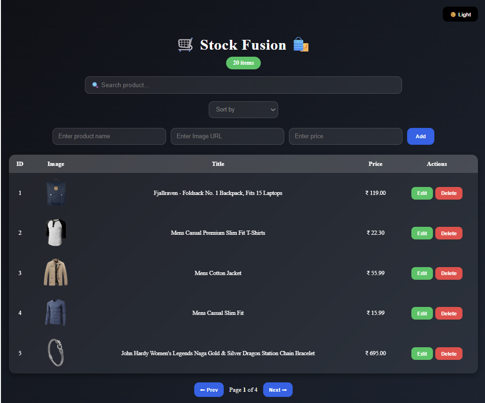
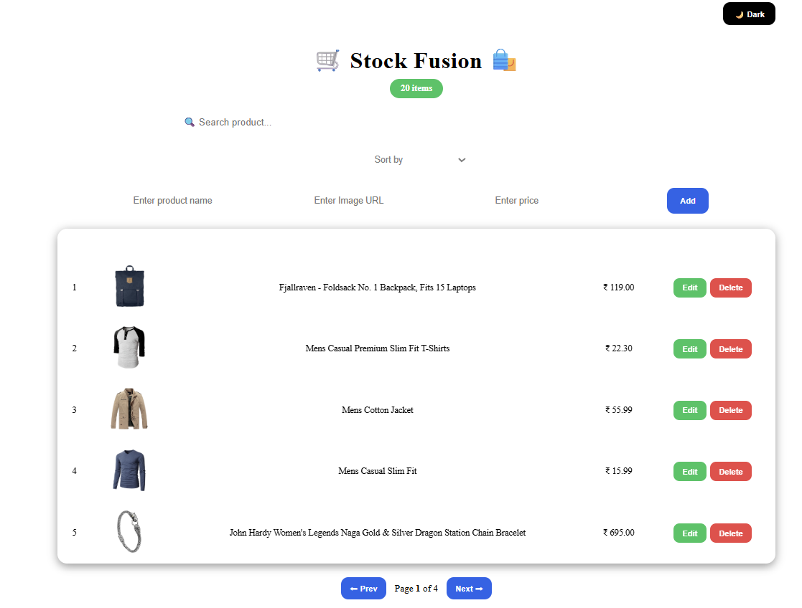

# 📦 **Stock Fusion — Inventory Management System (React.js)**

A modern, responsive, and feature-rich inventory management application built using **React.js**, featuring **CRUD operations**, live search, filtering, pagination, product preview modal, and dark/light theme mode.

### 🔗 **Live Demo:**

👉 https://stock-fusion-hk.netlify.app/
---

---

## ⭐ **Features**

### 🛍️ **Inventory CRUD Operations**

- Add new products with name, price, and image
- Edit existing products
- Delete products with auto-reindexing
- Update product details seamlessly

### 🔍 **Smart Search & Sorting**

- Live search with instant filtering
- Sort by:

  - Price: Low → High
  - Price: High → Low
  - Name: A → Z
  - Name: Z → A

### 📄 **Pagination**

- Auto-generated pages
- Easy navigation between product sets

### 🖼 **Product Preview Modal**

- Click product image to view in a smooth pop-up modal
- Glass-morphism UI
- Close with button or outside click

### 🌗 **Dark / Light Mode**

- Modern theme toggle
- Fully adaptive UI components
- CSS-animated transitions

### 💾 **Persistent Storage**

- LocalStorage stores all product updates
- REST API fallback from **FakeStore API**

---

## 🧠 **Tech Stack**

| Technology                  | Purpose                            |
| --------------------------- | ---------------------------------- |
| **React.js**                | UI components & state management   |
| **Vite**                    | High-speed development environment |
| **JavaScript (ES6+)**       | Core logic                         |
| **CSS3 / Glassmorphism UI** | Styling & animations               |
| **LocalStorage**            | Persistent data storage            |
| **FakeStore API**           | Initial data population            |

---

## 📂 **Project Structure**

```
📁 StockFusionApp
 ┣ 📁 public
 ┣ 📁 src
 ┃ ┣ 📄 App.jsx
 ┃ ┣ 📄 main.jsx
 ┃ ┣ 📄 StockFusionPage.jsx
 ┃ ┣ 📄 StockFusionPageStyle.css
 ┣ 📄 package.json
 ┣ 📄 index.html
 ┣ 📄 vite.config.js
 ┣ 📄 README.md
```

---

## ⚙️ **Installation & Setup**

### 1️⃣ Clone the repository

```bash
git clone https://github.com/your-username/stock-fusion.git
cd stock-fusion
```

### 2️⃣ Install dependencies

```bash
npm install
```

### 3️⃣ Start the development server

```bash
npm run dev
```

---

## 🖼 **Screenshots**

<table> <tr> <td align="center"><b>🌙 Dark Mode</b></td> <td align="center"><b>☀️ Light Mode</b></td> </tr> <tr> <td></td> <td></td> </tr> </table> <br/>

### 🖼 Product Preview Modal

<p align="center">  </p>

## 📌 **Core Functionalities (Code Logic Summary)**

### ✔ CRUD using React Hooks

- `useState()` handles product lists, form values, editing, searching
- Auto-increment & reindexing on update/delete
- LocalStorage sync using `useEffect()`

### ✔ Smart Sorting

```js
if (sort === "price-low") return [...items].sort((a, b) => a.price - b.price);
```

### ✔ Persistent storage

```js
localStorage.setItem("products", JSON.stringify(products));
```

### ✔ Responsive Modal

Uses CSS animations `fadeIn` & `popIn` for smooth UI

---

## 🎯 **What I Learned**

- Managing component-level state with React Hooks
- Building fully functional CRUD systems
- Implementing modal popups and interactive UI effects
- Designing dark/light themes
- Data persistence using LocalStorage
- Enhancing UX through animations & glassmorphism

---

## 🤝 **Contributions**

Pull requests are welcome. For major changes, please open an issue first to discuss what you'd like to modify.

---

## 📜 **License**

This project is licensed under the **MIT License**.

---
